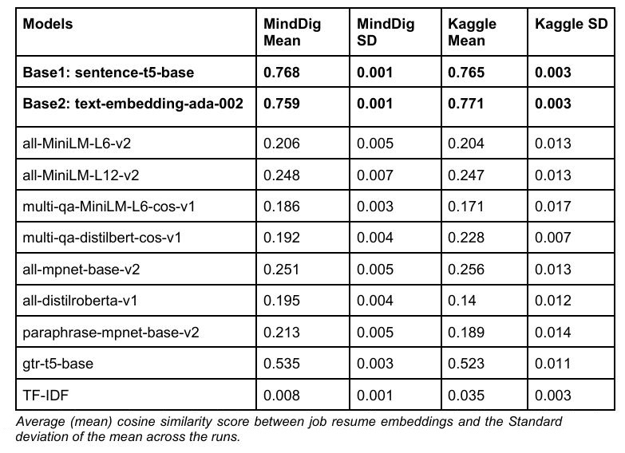
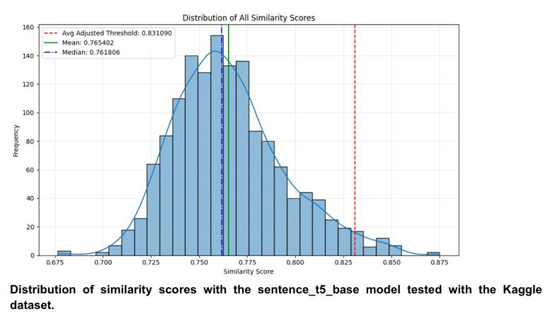
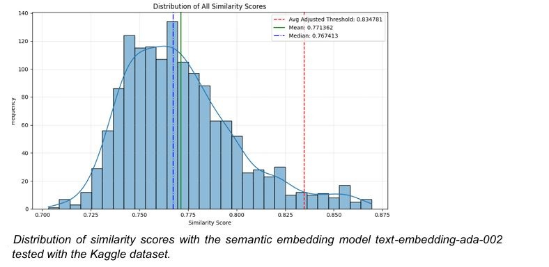
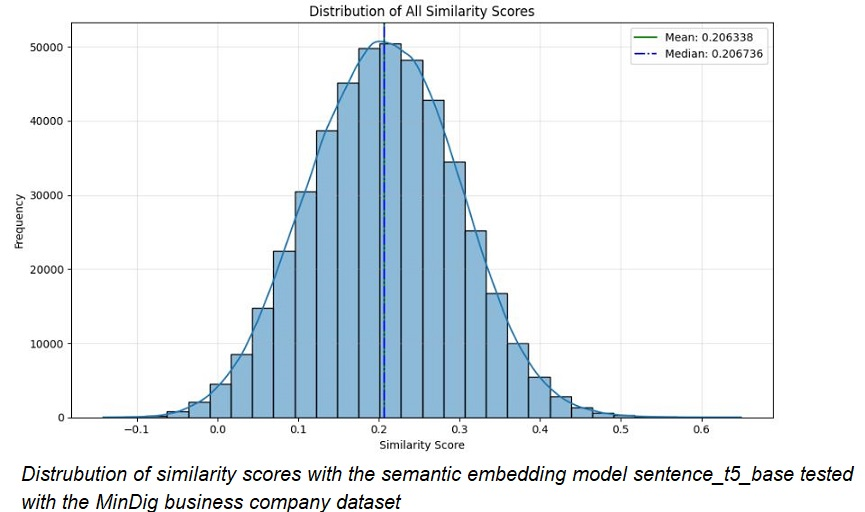
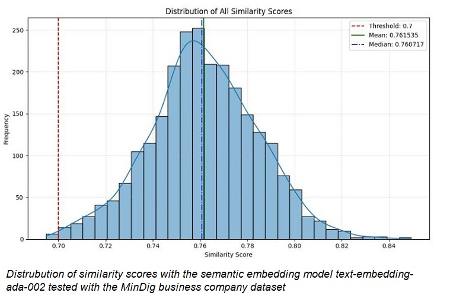

# machine-learning-job-resume-matching
Machine learning techniques for matching candidate resumes with job advertisements using transformer embeddings and cosine similarity.

Master Thesis — Luleå University of Technology  
Author: Aleksandra Stefanova  
Master Programme in Data Science (2025)

---

## Overview

This repository contains the implementation and experimental notebooks for my master thesis research on machine learning techniques for resume-job matching.

The project compares traditional keyword-based approaches with modern transformer-based semantic embedding models for candidate-job similarity matching tasks.

The research evaluates multiple machine learning approaches across public and private recruitment datasets, including:

- TF-IDF + Cosine Similarity
- OpenAI text-embedding-ada-002
- Sentence Transformers
- MiniLM variants
- MPNet variants
- DistilRoBERTa
- T5-based embedding models

The study investigates how modern semantic embeddings outperform traditional ATS keyword matching systems in resume-job matching tasks.

---

## Research Question

> Which machine learning techniques provide the most effective matching between candidate profiles and job advertisements, and under what circumstances do certain techniques outperform others?

---

## Datasets

### Public Dataset
- Kaggle Resume Dataset
- Human-annotated resume-job pairs

### Private Dataset
- MindDig recruitment platform dataset
- 6000+ resumes
- 1600+ job advertisements

**Note:** The MindDig dataset is not included in this repository due to NDA/privacy restrictions.

---

## Models Evaluated

| Model | Type |
|---|---|
| text-embedding-ada-002 | Semantic Embedding |
| sentence-t5-base | Sentence Transformer |
| all-MiniLM-L6-v2 | Sentence Transformer |
| all-MiniLM-L12-v2 | Sentence Transformer |
| all-mpnet-base-v2 | Sentence Transformer |
| paraphrase-mpnet-base-v2 | Sentence Transformer |
| gtr-t5-base | Sentence Transformer |
| multi-qa-MiniLM-L6-cos-v1 | QA Embedding |
| multi-qa-distilbert-cos-v1 | QA Embedding |
| all-distilroberta-v1 | Transformer |
| TF-IDF + Cosine Similarity | Traditional NLP |

---

## Key Findings

- T5-based and OpenAI embedding models achieved the highest semantic similarity performance.
- Traditional TF-IDF keyword matching performed significantly worse.
- Transformer embeddings captured semantic relationships more effectively than keyword overlap methods.
- Sentence-level embeddings were highly effective for resume-job similarity tasks.

---

## Technologies Used

- Python
- Scikit-learn
- SentenceTransformers
- Transformers
- OpenAI API
- Pandas
- NumPy
- Matplotlib
- Cosine Similarity
- Natural Language Processing (NLP)

---

## Repository Structure

```bash
machine-learning-job-resume-matching/
│
├── images/
│   ├── ada_kaggle.JPG
│   ├── ada_minddig.JPG
│   ├── model_comparison.JPG
│   ├── sentence_t5_kaggle.JPG
│   └── sentence_t5_minddig.JPG
│
├── notebooks/
│   ├── kaggle-dataset/
│   │   ├── ada_002_Kaggle_dataset.ipynb
│   │   └── ...
│   │
│   └── minddig-dataset/
│       ├── ada_002_MindDig_dataset.ipynb
│       └── ...
│
├── thesis/
│   └── Stefanova (2024) Machine Learning Techniques for Matching.pdf
│
├── README.md
│
└── requirements.txt
```

---

## How to Run

### Clone the repository

```bash
git clone https://github.com/yourusername/resume-job-matching-ml.git
cd resume-job-matching-ml
```

### Install dependencies

```bash
pip install -r requirements.txt
```

### Run notebooks

Open the notebooks using Jupyter Notebook or Google Colab.

---

## Thesis

The complete master's thesis is available in the `thesis/` folder.

---

## Results

### Model Comparison



Performance comparison of multiple semantic embedding models evaluated on both the Kaggle and MindDig datasets.

### Dataset-Specific Results

#### Kaggle Dataset



Sentence-T5 performance on the Kaggle resume-job matching dataset.



OpenAI text-embedding-ada-002 performance on the Kaggle dataset.

#### MindDig Dataset



Sentence-T5 performance on the MindDig recruitment dataset.



OpenAI text-embedding-ada-002 performance on the MindDig dataset.

## Citation

```bibtex
@mastersthesis{stefanova2025matching,
  title={Machine Learning Techniques for Matching Candidates' Profiles With Job Advertisements},
  author={Stefanova, Aleksandra},
  school={Luleå University of Technology},
  year={2025}
}
```


---

## License

This project is released for academic and research purposes.
